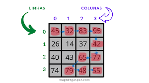

# MatrizGulosa
AEDS | CEFET-MG

 
 
</a> 

 

 

	O trabalho Matriz Gulosa consiste em percorrer uma matriz de tamanho N x N, a partir da posição [0]x[0], passando apenas pelo maior valor adjacente, com o objetivo de chegar até a posição [N-1]x[N-1]. Dessa forma, o algorítmo orienta à apenas "andar" em 5 direções, leste, sudeste, sul, sudoeste e oeste, seguindo essa ordem de prioridade respectivamente.

	O algorítimo foi separado em funções. As três primeiras funções presentes no arquivo .hpp (linhas 29, 30 e 31) servem para randomizar um número pré estabelecido de matrizes e imprimí-las no arquivo .data. As duas funções finais (linhas 33 e 34) servem para ler as matrizes do arquivo input.data e percorre-las no caminho correto, respectivamente.

	A função responsável pela leitura das matrizes do arquivo input.data (void Ler Matriz), funciona da seguinte forma: ela lê linha por linha da matriz (linha 56) e separa essa linha lida em substrings (linha 61), cada substring entra em uma posição da matriz. Ao final do loop for, que roda no número de linhas e colunas da matriz, o algorítimo encerra o trabalho na matriz atual e passa para a matriz seguinte.

 

	Passando para a função de "percorrer" a matriz, ela trabalha em cima de ordens de prioridade e restrições, por exemplo: para percorrer a matriz, existe a restrição de não "subi-la", pois o objetivo é chegar ao ponto extremo inferior direito, dessa forma, não faria sentido acessar uma posição cuja linha seja menor que a atual (linhas 128 a 157). 

A partir da Fig. 1 é possível observar o funcionamento prático da matriz gulosa e sua ordem de prioridade. Partindo da posição [0]x[0], a próxima porição acessada foi a [0]x[1], que guardava o número 32. O algorítimo priorizou essa posição, pois, ao ordenar um vetor com o valor armazenado nas posições adjacentes à posição atual, o número 32 foi o maior. Observe também que, caso a posição atual tenha como coluna [0] ou [N-1], não será necessária a análise das posições à esquerda ou à direita, respectivamente, por não existirem na matriz.

Para saber qual é a próxima posição a ser percorrida na matriz, o algorítimo seleciona todas os caminhos possíveis (linhas 104 a 116) e armazena os valores contidos nessas posições em um vetor, que por sua vez, é ordenado de forma decrescente (linha 121). Dessa forma, o programa verifica novamente as posições possíveis e aquela que contiver o valor armazenado na primeira posição do vetor ordenado é a que será direcionado o caminho.

Caso o algorítimo leve até a ultima linha, ele propõe que exista apenas a direção leste como possibilidade (linha 123). Como pode-se observar na Fig. 1, ao chegar na posição [3]x[1], o maior número adjacente seria o 74, porém como ele atingiu a ultima linha, ele seguiu a direita até encontrar a posição final.

Caso existam dois números iguais nas posições adjacentes à atual, o algorítimo segue a ordem de prioridade de sentido citada acima. Ao encontrar a posição que armazena esse maior número, ele avança para tal posição, ignorando o mesmo número em outra posição menos prioritária.

Durante o caminho, é também tratado no algorítimo o tamanho do caminho percorrido, representado pela soma dos números que guardavam as posições. No caso da Fig. 1, o caminho total foi 621 (linha 165). 

No fim do programa, ao tratar de todas as matrizes presentes no arquivo input.data, ele, por fim, faz o somatório total do caminho de todas as matrizes e exibe ao usuário (linha 183).

# Compilação e Execução

A estrutura árvore disponibilizada possui um arquivo Makefile que realiza todo o procedimento de compilação e execução. Para tanto, temos as seguintes diretrizes de execução:

| Comando                |  Função                                                                                           |                     
| -----------------------| ------------------------------------------------------------------------------------------------- |
|  `make clean`          | Apaga a última compilação realizada contida na pasta build                                        |
|  `make`                | Executa a compilação do programa utilizando o gcc, e o resultado vai para a pasta build           |
|  `make run`            | Executa o programa da pasta build após a realização da compilação                                 |

<a style="color:black" href="mailto:felipeparreiras86@gmail.com?subject=[GitHub]%20Source%20Dynamic%20Lists">
✉️ <i>felipeparreiras86@gmail.com</i>
</a>
